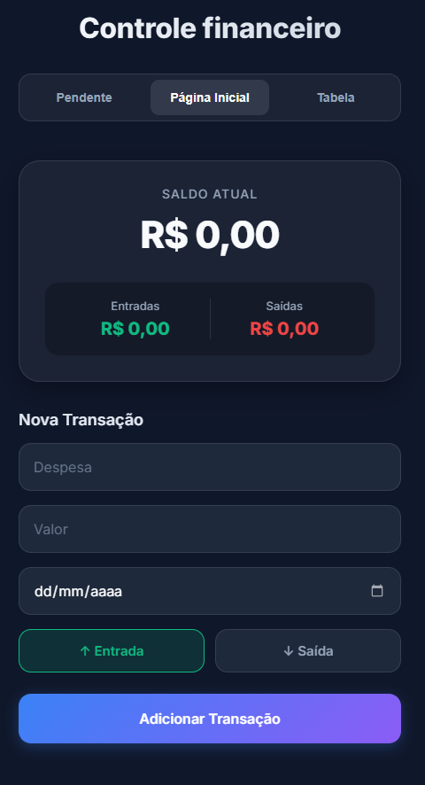
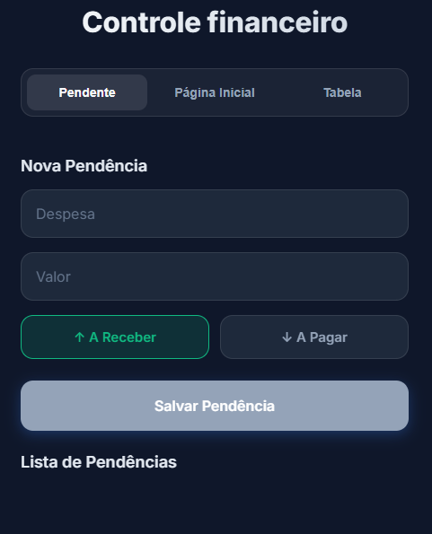
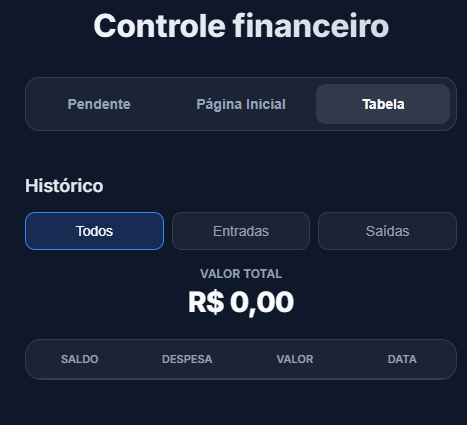
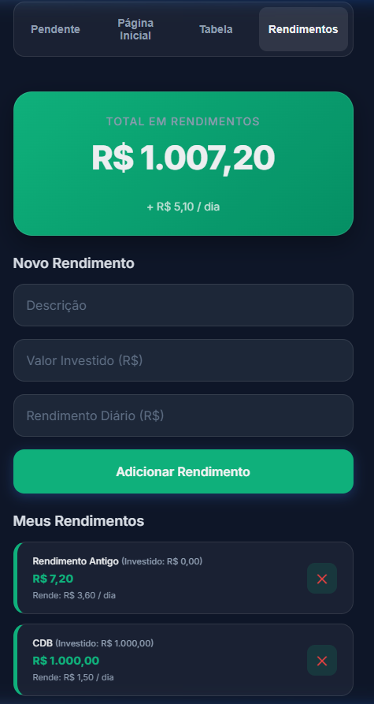

# Financial Control

Um simples e elegante aplicativo web para controle financeiro pessoal. Projetado usando tecnologias web modernas e focado em uma experiência mobile ágil.

## Funcionalidades
- **Gestão de Gastos e Ganhos:** Adicione facilmente suas entradas e saídas.
- **Rendimentos Dinâmicos:** Acompanhe o crescimento dos seus investimentos em uma aba dedicada que calcula rendimentos diários automaticamente.
- **Histórico Completo:** Visualize suas transações em uma tabela organizada por data.
- **Filtros e Edição Rápida:** Filtre por tipo de transação e edite valores segurando a linha na tabela (long-press).
- **Offline First (PWA):** Funciona sem internet e salva tudo no seu próprio aparelho através do `localStorage`. Não requer criação de conta.
- **Instalável no Celular:** Pode ser adicionado à tela inicial (iOS ou Android) e funcionar como um aplicativo nativo.

## Telas do Aplicativo

### Página Inicial (Resumo e Nova Transação)

### Aba de Pendências

### Tabela de Transações

### Rendimentos Dinâmicos
Acompanhe e simule o crescimento diário dos seus aportes de investimento.

## Como Usar
Basta acessar o link do GitHub Pages gerado por este repositório através do navegador do celular. Depois, vá nas opções do navegador e clique em **"Adicionar à Tela de Início"**.
